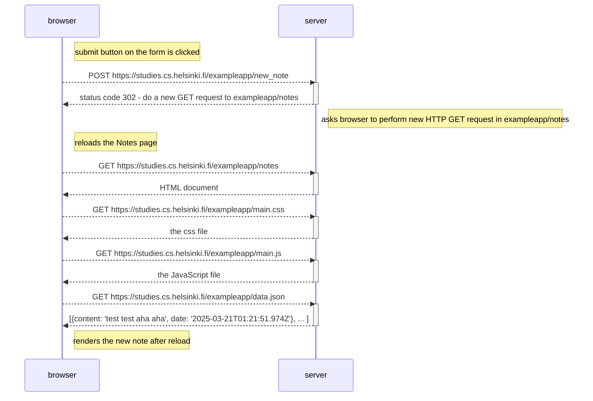

```mermaid
sequenceDiagram
    participant browser
    participant server

    Note right of browser: submit button on the form is clicked
    browser-->>server: POST https://studies.cs.helsinki.fi/exampleapp/new_note
    activate server
    server-->>browser: status code 302 - do a new GET request to exampleapp/notes
    deactivate server
    Note right of server: asks browser to perform new HTTP GET request in exampleapp/notes

    Note right of browser: reloads the Notes page

    browser-->>server: GET https://studies.cs.helsinki.fi/exampleapp/notes
    activate server
    server-->>browser: HTML document
    deactivate server
    
    browser-->>server: GET https://studies.cs.helsinki.fi/exampleapp/main.css
    activate server
    server-->>browser: the css file
    deactivate server

    browser-->>server: GET https://studies.cs.helsinki.fi/exampleapp/main.js
    activate server
    server-->>browser: the JavaScript file
    deactivate server

    browser-->>server: GET https://studies.cs.helsinki.fi/exampleapp/data.json
    activate server
    server-->>browser: [{content: 'test test aha aha', date: '2025-03-21T01:21:51.974Z'}, ... ]
    deactivate server


    Note right of browser: renders the new note after reload

        
```